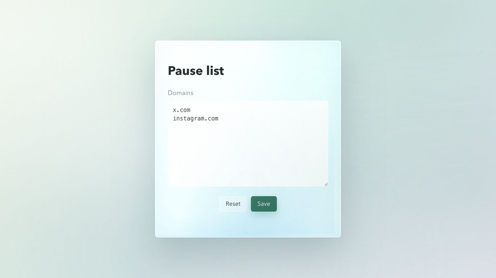

# Focusd

Focusd is a Chrome extension that helps you stay focused by adding a short pause before distracting websites open.

When you navigate to a configured domain, Focusd replaces the tab with a calm interstitial. The water circle fills for three seconds, giving you a moment to decide if you really want to visit that distracting site right now. You can continue intentionally, or leave and return to what you were doing.

Focusd is free forever.

Default paused domains:

- `x.com`
- `instagram.com`

## Screenshots




## Features

- Manifest V3 Chrome extension
- Configurable domain list
- Subdomain matching, for example `instagram.com` matches `www.instagram.com`
- Three-second decision pause before continuing
- Helps interrupt automatic visits to distracting sites
- Free forever
- Animated ocean-style WebGPU water button
- CSS fallback for browsers without WebGPU
- Local settings page stored with `chrome.storage.sync`

## Install

1. Download or clone this repository.
2. Open `chrome://extensions`.
3. Enable **Developer mode**.
4. Click **Load unpacked**.
5. Select the project folder.

## Configure Domains

Click the Focusd extension icon to open settings.

Add one domain per line:

```text
x.com
instagram.com
youtube.com
```

Do not include paths. Focusd normalizes entries such as `https://example.com/feed` to `example.com`.

## How It Works

Focusd listens for top-level navigations with `chrome.webNavigation`. If the destination hostname matches your pause list, the tab is redirected to the extension interstitial instead of opening the distracting site immediately.

The interstitial waits three seconds before enabling the water circle as the `Open` button. That short pause is the core behavior: it gives you time to make a conscious decision instead of following the impulse automatically. Choosing `Open` temporarily allows that exact navigation, then redirects the tab to the original URL.

## Permissions

Focusd uses:

- `webNavigation` to detect top-level page navigation
- `storage` to save the domain list
- `<all_urls>` host permission so it can compare navigated URLs against your configured domains

Focusd uses the Chrome Tabs API only to update or close the current tab. It does not request the sensitive `tabs` permission.

## Development

This extension is plain HTML, CSS, and JavaScript.

Useful local checks:

```sh
npm run validate
```

Build a Chrome Web Store upload package:

```sh
npm run build
```

For local browser preview:

```sh
python3 -m http.server 4173
```

Then open:

```text
http://localhost:4173/src/interstitial.html?target=https%3A%2F%2Fx.com%2Fhome
```
